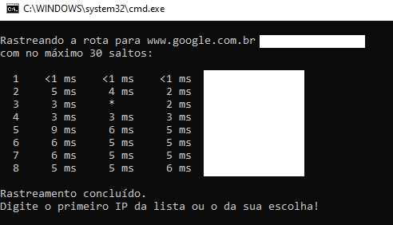
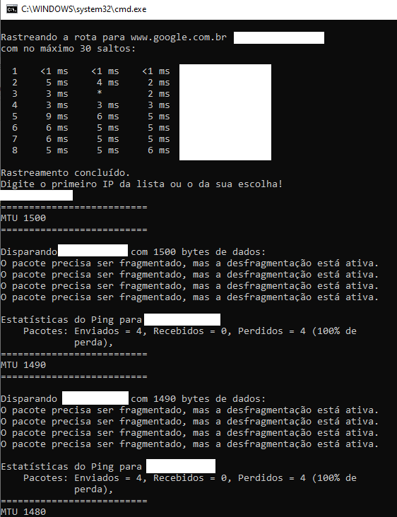
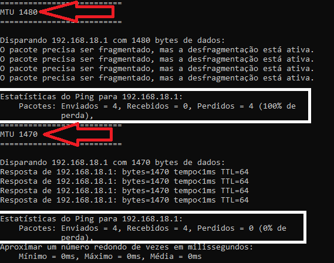
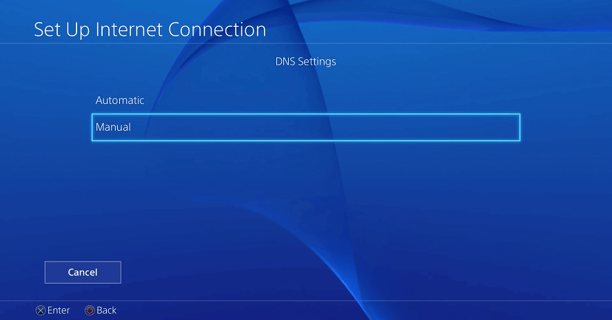
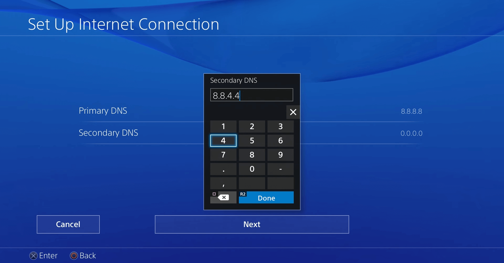
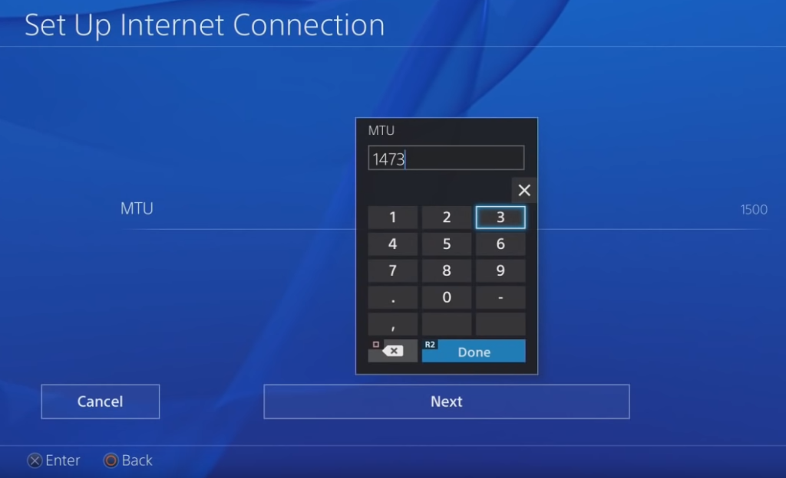

## O que são DNS e para que servem?

O DNS ou Domain Name System é um sistema de nomenclatura hierárquica descentralizada para dispositivos conectados, pela Internet ou em redes privadas. Este sistema associa informações ao nome do domínio, ou seja, sua principal função é **traduza o nome de domínio para um endereço IP**. É realmente um grande banco de dados distribuído e hierárquico no qual as informações associadas ao nome de domínio são armazenadas e capazes de se associar aos seus endereços IP.

## O que é MTU?

MTU é a sigla em inglês para Unidade Máxima de Transmissão e ela se refere a uma configuração em dispositivos e roteadores que determina o maior tamanho (em bytes) de qualquer pacote único de dados que pode ser enviado de uma vez da fonte para o destino.

## Vantagens de servidores DNS alternativos

Entre os diferentes servidores DNS alternativos e os dos operadores, podemos dizer que existem certas diferenças que podem nos ajudar a tornar nossa conexão mais estável e mais rápida, mas também podem oferecer algumas funções interessantes:

**Estabilidade :** Servidores DNS alternativos oferecem maior confiabilidade, estabilidade e maior tempo de atividade real.

**Velocidade :** geralmente oferecem velocidades de carga inferiores ao DNS dos operadores.

**Segurança :** alguns desses DNS alternativos oferecem proteção contra phishing.

#### Funções adicionadas:

**Evite restrições :** Eles permitem o acesso a domínios bloqueados por geolocalização.

**controlo parental :** Alguns também oferecem a possibilidade de criar certos filtros para proteger o acesso a páginas com conteúdo indesejado.

## O melhor DNS para PS3, PS4
A verdade é que existe uma grande lista de servidores DNS alternativos dos quais podemos escolher os que oferecem a melhor experiência. No caso de querer usar servidores DNS alternativos para o PS4 e, assim, melhorar nossa experiência de jogo, observe o seguinte:

**Página inicial do OpenDNS -** 208.67.222.222 e 208.67.220.220

**Cloudflare -** 1.1.1.1 e 1.0.0.1

**IBM Quad9 -** 9.9.9.9

**Google -** 8.8.8.8 e 8.8.4.4

Embora esses quatro sejam os mais rápidos, a verdade é que você deve ter em mente que os do Google são os que oferecem menos privacidade.

Agora, esses são outros servidores alternativos que também podemos tentar, embora os mais recomendados sejam os quatro mencionados anteriormente:

Nível3 - 209.244.0.3 e 209.244.0.4

Verisign - 64.6.64.6 e 64.6.65.6

RELÓGIO - 84.200.69.80 e 84.200.70.40

Comodo Secure DNS - 8.26.56.26 e 8.20.247.20

GreenTeamDNS - 81.218.119.11 e 209.88.198.133

SafeDNS - 195.46.39.39 e 195.46.39.40

OpenNIC - 96.90.175.167 e 193.183.98.154

SmartViper - 208.76.50.50 e 208.76.51.51

Dyn - 216.146.35.35 e 216.146.36.36

FreeDNS - 37.235.1.174 e 37.235.1.177

DNS alternativo - 198.101.242.72 e 23.253.163.53

DNS - 77.88.8.8 e 77.88.8.1

UncensoredDNS - 91,239,100,100 e 89,233.43.71

Hurricane Electric - 74.82.42.42

puntCAT - 109.69.8.51

Neustar - 156.154.70.1 e 156.154.71.1

Quarto Estado - 45.77.165.194

CleanBrowsing - 185.228.168.9 e 185.228.169.9

UltraDNS - 156.154.70.1, 156.154.71.1

Família UltraDNS - 156.154.70.3 e 156.154.71.3

## Alterando o MTU

clique em best-mtu.bat, para execurtar um comando que verificara uma lista de conexôes de IP's com o [www.google.com](https://www.google.com).

após finalizar a verificação dos IP's, ira ser requerido que sejá inserido um IP da lista, normalmente o primeiro IP é o da maquina que fez a requisição, pode ser usado para fazer o teste, ou tambem pode ser usado o IP da maquina que irá receber essas configurações.

irá ser feito requisições de teste com as configurações 1500, 1490, 1480, 1470, 1460, 1450.

devera verificar qual o numero MTU retornou 0% de perdas de dados como da foto a seguir:

no exemplo, com uma conexão de 1480, teve 100% de perda de dados, mas com uma conexão de 1470 já teve 0% de perda de dados.

com esse numero anotado, agora deverá fazer a configuração no PS4.

## Como mudar o DNS e o MTU no PS4

Entre em **Configurações.**

Em seguida, vá até **Rede> Configurar conexão de internet.**

Escolha entre **WiFi** ou **cabo**, dependendo de como quer conectar à Internet.

Mantenha o **Endereço IP em ( automático )**, em **DHCP** selecione a opção **Não especificar**.

Agora em **DNS** selecionar o modo **manual**.

Digite os dois **DNS** do google, ou outros de sua escolha.

Com o novo **DNS** configurado, é hora de alterar o **MTU**. utilize o número que você alcançou no processo **realizado no PC**, que teve **0% de perda de dados**.

**Exp.: 1470**

Com tudo pronto, salve a configuração. Em alguns casos, é **necessário reiniciar o videogame** para que tudo funcione como devido. Se o procedimento foi realizado corretamente, o PS4 aumentará a velocidade do download. Em testes realizados com Internet de **15 mbps**, a taxa de downloads **atingiu 1,5 MB/s.**

